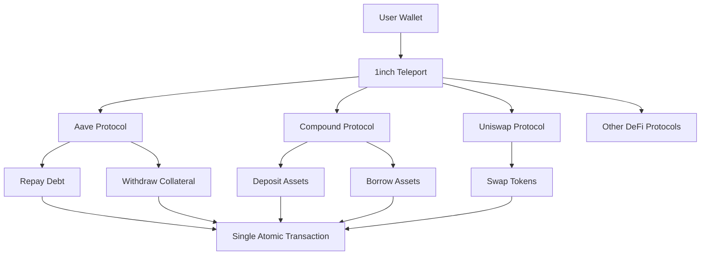
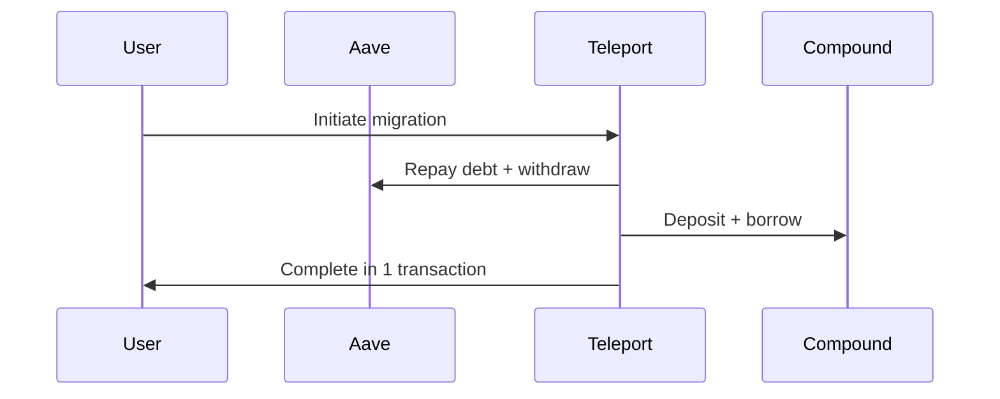
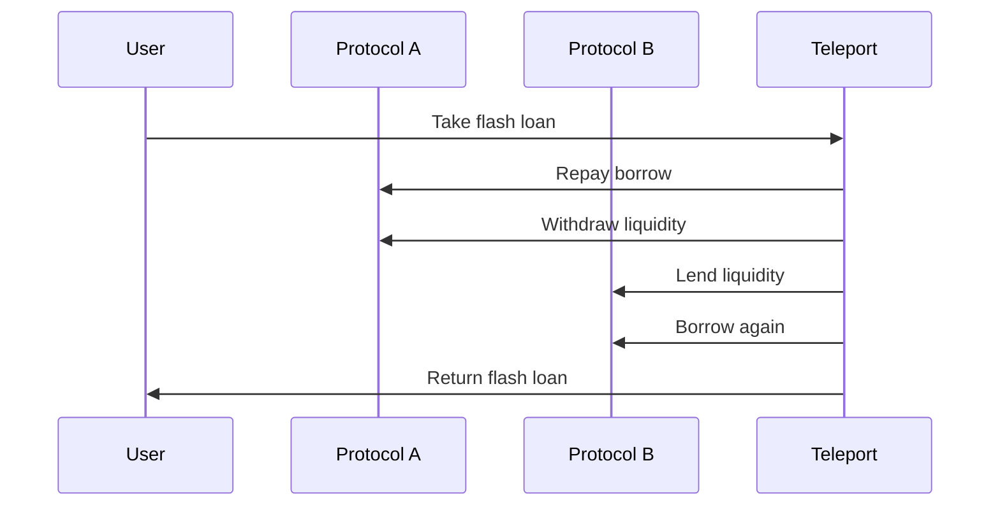

# 🚀 1inch Teleport - Cross-Protocol DeFi Solution

<div align="center">


**Unified DeFi Portfolio Management Across Multiple Protocols**

[](https://teleport-pearl.vercel.app)
[](https://github.com/vm06007/teleport/)

</div>

---

## 📁 Project Structure

This repository contains **two distinct applications**:

### 🏠 **Landing Page** (`/src` folder)
- **Location**: Root `/src` directory
- **Purpose**: Marketing landing page explaining the 1inch Teleport solution
- **URL**: `http://localhost:5173/` (root)
- **Features**: 
  - Product overview and features
  - Cross-protocol solution explanation
  - Supported protocols showcase
  - Smooth scrolling navigation

### 🎯 **Main DeFi App** (`/starter-kit` folder)
- **Location**: `/starter-kit` directory  
- **Purpose**: Full-featured DeFi portfolio management application
- **URL**: `http://localhost:5174/` (separate dev server)
- **Features**:
  - Multi-protocol portfolio tracking
  - Real-time DeFi position monitoring
  - Cross-chain liquidity management
  - 1inch API integration

---

## 🎯 What is 1inch Teleport?

**1inch Teleport** is a revolutionary cross-protocol DeFi solution that simplifies complex multi-step transactions into **single atomic operations**. 

### 🔄 Cross-Protocol Operations Made Simple

Traditional DeFi operations often require multiple transactions across different protocols:

```
Aave → Repay Debt → Withdraw Collateral → 1inch Swap → Compound Deposit
```

**With 1inch Teleport, this becomes:**
```
Aave → 1inch Teleport → Compound (1 transaction)
```

### 🚀 Key Benefits

- **⚡ Single Transaction**: Complex multi-protocol operations in one atomic transaction
- **💰 Cost Efficient**: Reduced gas fees and transaction costs
- **🛡️ Risk Mitigation**: No MEV attacks or failed intermediate transactions
- **🌉 Cross-Protocol**: Seamlessly move between Aave, Compound, Uniswap, Spark, and more
- **🔒 Atomic Execution**: All-or-nothing transaction execution
- **📦 Bulk Operations**: Collect interest and withdraw liquidity from multiple protocols simultaneously
- **🎯 Smart Batching**: Automatically optimize transaction batching for maximum efficiency

### 🚀 **Revolutionary Bulk Operations**

**Traditional DeFi Management:**
```
Spark → Collect Interest → Uniswap → Collect Fees → Aave → Collect Rewards (3 separate transactions)
```

**With 1inch Teleport:**
```
Collect All Interest & Fees → Single Transaction (1 atomic operation)
```

**Key Bulk Features:**
- **🔄 Bulk Interest Collection**: Collect from multiple protocols in one click
- **💧 Bulk Liquidity Withdrawal**: Withdraw from all active positions simultaneously
- **📊 Multi-Position Management**: Select and manage multiple Uniswap V4 positions at once
- **🎯 Cross-Protocol Aggregation**: View and act on all protocols from a single dashboard

---

## 🏗️ Architecture Overview



---

## 🚀 Quick Start

### Prerequisites
- **Node.js** (v18 or higher)
- **Bun** (recommended) or **npm**
- **1inch API Key** ([Get one here](https://portal.1inch.dev/))

### 1. Clone the Repository
```bash
git clone https://github.com/vm06007/teleport.git
cd teleport
```

### 2. Install Dependencies

#### For Landing Page (Root)
```bash
bun install
```

#### For Main App (Starter Kit)
```bash
cd starter-kit
bun install
```

### 3. Configure Environment Variables

Create `.env.local` in the root directory:
```env
VITE_ONEINCH_API_KEY=your_1inch_api_key_here
```

### 4. Set Up Proxy Server for 1inch API

The application uses a proxy server to handle 1inch API calls securely. Follow these steps:

#### Option A: Using Environment Variable (Recommended)
```bash
# Create .env file in root directory
echo "ONEINCH_API_KEY=your_api_key_here" > .env
```

#### Option B: Direct API Key Setup
Edit `server.js` line 9:
```javascript
const API_KEY = process.env.ONEINCH_API_KEY || "your_actual_api_key_here";
```

#### Option C: Command Line
```bash
ONEINCH_API_KEY=your_api_key_here node server.js
```

### 5. Start the Applications

#### Option A: Run Both Simultaneously

**Terminal 1 - Proxy Server:**
```bash
# From root directory
node server.js
# Proxy server runs on: http://localhost:5003
```

**Terminal 2 - Landing Page:**
```bash
# From root directory
bun run dev
# Access at: http://localhost:5173/
```

**Terminal 3 - Main App:**
```bash
# From root directory
cd starter-kit
bun run dev
# Access at: http://localhost:5174/
```

#### Option B: Run Main App Only
```bash
cd starter-kit
bun run dev
# Access at: http://localhost:5174/
```

**Note**: The main app requires the proxy server to be running for 1inch API functionality.

---

## 📱 Application Features

### 🏠 Landing Page Features
- **Smooth Scrolling Navigation**: Jump to any section instantly
- **Cross-Protocol Explanation**: Visual diagrams of complex DeFi operations
- **Supported Protocols**: Showcase of integrated DeFi protocols
- **Responsive Design**: Works perfectly on all devices
- **GitHub Integration**: Direct link to project repository

### 🎯 Main App Features
- **Multi-Protocol Portfolio**: Track positions across Aave, Compound, Uniswap, Spark, Pendle, Curve, and 1inch
- **Real-Time Data**: Live updates from 1inch API and protocol integrations
- **Cross-Chain Support**: Ethereum, Polygon, Arbitrum
- **Wallet Integration**: Connect multiple wallets with secure Web3 integration
- **Advanced Analytics**: Portfolio performance and risk metrics

#### 🚀 **Bulk Operations - The Game Changer**

**Collect Interest/Rewards in Bulk**
- **Single-Click Collection**: Collect interest from multiple protocols simultaneously
- **Cross-Protocol Aggregation**: Combine rewards from Spark, Uniswap V4, and other protocols
- **Total Claimable**: View aggregated claimable interest across all active positions
- **Smart Batching**: Automatically batch transactions to minimize gas costs

**Withdraw Liquidity in Bulk**
- **Multi-Position Withdrawal**: Withdraw liquidity from multiple positions at once
- **Cross-Protocol Liquidity Management**: Move funds between Aave, Uniswap, Spark, and other protocols
- **Total Supplied Overview**: Track total liquidity across all protocols
- **Atomic Operations**: Execute complex multi-protocol withdrawals in single transactions

#### 📊 **Portfolio Dashboard Features**
- **Protocol Overview Cards**: Visual representation of each protocol with current values
- **Active Position Tracking**: Real-time monitoring of Spark and Uniswap V4 positions
- **APY Performance**: Track average APY across all protocols
- **Interest Accumulation**: Monitor claimable interest growth across all protocols
- **Position Selection**: Select specific positions for targeted actions

#### 🎯 **Uniswap V4 Integration**
- **Position Management**: View and manage individual Uniswap V4 positions
- **Fee Collection**: Collect accumulated fees from all position pairs
- **Bulk Fee Collection**: Collect fees from multiple positions simultaneously
- **Liquidity Withdrawal**: Withdraw liquidity from selected positions in batch operations
- **Position Analytics**: Track fees available per position

#### 🔄 **Cross-Protocol Workflows**
- **Interest Collection**: Collect from multiple protocols in one transaction
- **Liquidity Withdrawal**: Withdraw from all active positions simultaneously
- **Protocol Migration**: Move funds between protocols efficiently
- **Risk Management**: Diversify across multiple protocols while maintaining single-point control

---

## 🔧 Technical Stack

### Landing Page (`/src`)
- **Frontend**: React 18 + Material-UI
- **Styling**: CSS3 with custom animations
- **Build Tool**: Vite
- **Package Manager**: Bun

### Main App (`/starter-kit`)
- **Frontend**: React 19 + TypeScript
- **UI Framework**: Flowbite React + Tailwind CSS
- **Web3**: Wagmi + Viem
- **Charts**: ApexCharts
- **State Management**: React Query
- **Build Tool**: Vite + TypeScript

---

## 🌐 API Integration

### 1inch API Setup
The application uses the 1inch API for cross-protocol operations:

```javascript
// Example API call
const response = await fetch(`/proxy?url=${encodeURIComponent(apiUrl)}`, {
  headers: {
    'Authorization': `Bearer ${apiKey}`
  }
});
```

### Supported Protocols
- **Lending**: Aave, Compound, Spark
- **DEX**: Uniswap, Curve, 1inch
- **Yield**: Yearn Finance, Convex
- **Cross-Chain**: Polygon, Arbitrum, BSC

---

## 🎨 Cross-Protocol Flow Examples

### Example 1: Aave to Compound Migration


### Example 2: Flash Loan Arbitrage


---

## 🛠️ Development

### Project Structure
```
teleport/
├── src/                    # Landing page
│   ├── components/        # React components
│   ├── containers/        # Page sections
│   ├── utils/            # Utilities and content
│   └── assets/           # Images and static files
├── starter-kit/           # Main DeFi application
│   ├── src/
│   │   ├── views/        # Page components
│   │   ├── layouts/      # Layout components
│   │   ├── components/   # Reusable components
│   │   └── config/       # Configuration files
│   └── package.json
├── server.js             # Proxy server
└── package.json          # Root dependencies
```

### Available Scripts

#### Root (Landing Page)
```bash
bun run dev          # Start development server
bun run build        # Build for production
bun run preview      # Preview production build
bun run server       # Start proxy server
```

#### Starter Kit (Main App)
```bash
cd starter-kit
bun run dev          # Start development server
bun run build        # Build for production
bun run lint         # Run ESLint
```

---

## 🧪 Testing

### API Testing
```bash
# Test 1inch API connection
node test-1inch-api.js

# Test all protocols
node test-all-protocols.js

# Test specific protocols
node test-aave-api.js
node test-uniswap-positions.js
```

### Browser Testing
```bash
# Test API endpoints
open test-api.html
```

---

## 🚀 Deployment

### Landing Page
```bash
bun run build
# Deploy dist/ folder to your hosting service
```

### Main App
```bash
cd starter-kit
bun run build
# Deploy dist/ folder to your hosting service
```

### Environment Variables for Production
```env
VITE_ONEINCH_API_KEY=your_production_api_key
VITE_NETWORK=mainnet
VITE_CHAIN_ID=1
```

---

## 🔧 API Testing & Troubleshooting

### Testing 1inch API Connection
```bash
# Test basic API connection
node test-1inch-api.js

# Test all protocols
node test-all-protocols.js

# Test specific protocols
node test-aave-api.js
node test-uniswap-positions.js
node test-spark-protocol.js
```

### Proxy Server Troubleshooting

**Common Issues:**
- **"Unauthorized" errors**: Check your API key is set correctly
- **Proxy server not responding**: Ensure it's running on port 5003
- **CORS errors**: Verify the proxy server is running before starting the app
- **Rate limiting**: 1inch API has rate limits, avoid rapid requests

**Debug Steps:**
1. Check proxy server is running: `http://localhost:5003`
2. Verify API key in browser console
3. Test API endpoints directly
4. Check network tab for failed requests

### API Integration Details

The proxy server (`server.js`) handles all 1inch API calls:
```javascript
// Example API call through proxy
const response = await fetch(`/proxy?url=${encodeURIComponent(apiUrl)}`, {
  headers: {
    'Authorization': `Bearer ${apiKey}`
  }
});
```

**Supported Endpoints:**
- Portfolio positions across protocols
- Token swaps and quotes
- Liquidity pool data
- Cross-protocol operations

---

## 🤝 Contributing

1. **Fork** the repository
2. **Create** a feature branch (`git checkout -b feature/amazing-feature`)
3. **Commit** your changes (`git commit -m 'Add amazing feature'`)
4. **Push** to the branch (`git push origin feature/amazing-feature`)
5. **Open** a Pull Request

### Development Guidelines
- Follow TypeScript best practices
- Use 4-space indentation
- Write meaningful commit messages
- Test all changes thoroughly
- Update documentation as needed

---

## 📄 License

This project is licensed under the MIT License - see the [LICENSE](LICENSE) file for details.

---

## 🙏 Acknowledgments

- **1inch Team** for the amazing cross-protocol solution
- **Ethereum Community** for the DeFi ecosystem
- **React Team** for the excellent framework
- **Vite Team** for the fast build tool

---

## 📞 Support

- **GitHub Issues**: [Report bugs or request features](https://github.com/vm06007/teleport/issues)
- **Documentation**: [Read the docs](https://github.com/vm06007/teleport#readme)
- **Live Demo**: [Try the application](https://teleport-pearl.vercel.app)

---

<div align="center">

**Made with ❤️ by the Cross-Protocol Solutions Team**

[](https://github.com/vm06007/teleport/)
[](https://teleport-pearl.vercel.app)

</div>
